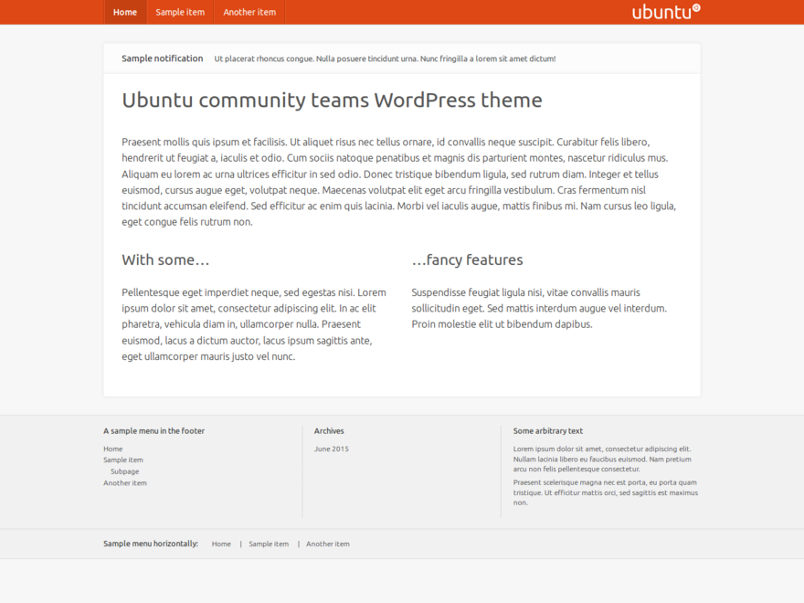

# Ubuntu Community WordPress Theme

Ubuntu topluluğu siteleri için tasarlanmış, sade ve modern bir WordPress teması. Ubuntu'nun resmi tasarım diline sadık kalarak responsive, RTL dil desteği ve kapsamlı özelleştirme seçenekleri sunar.



---

## Özellikler

- **Ana Sayfa Slider** — Customizer üzerinden seçilen yazıların öne çıkarılan görselleriyle otomatik kayan slider
- **Öne Çıkarılan Görsel** — Yazı listelerinde yatay (1280×427), tekil sayfalarda tam boy (1280×854) aspect-ratio ile otomatik kırpma
- **Türkçe Font Desteği** — Google Fonts üzerinden Ubuntu fontu, `latin-ext` alt kümesiyle Türkçe karakter desteği
- **Koyu Tema** — Customizer'dan tek tıkla etkinleştirilebilir karanlık görünüm
- **Renk Özelleştirme** — Başlık arka planı, bağlantı rengi, footer rengi Customizer'dan değiştirilebilir
- **Özel Sütun Kısayolu** — İçerikte `[cols]...[/cols]` etiketiyle 2–5 sütun düzeni
- **RTL Dil Desteği** — Arapça, İbranice gibi sağdan sola yazılan diller için tam destek
- **Widget Alanları** — Bildirim, sağ kenar çubuğu, altbilgi widget alanları
- **PHP 8.4 Uyumlu**

---

## Kurulum

1. Bu repoyu `ubuntu-community` adıyla `wp-content/themes/` altına kopyalayın:
   ```bash
   git clone git@github.com:bmericc/ubuntu-community.git wp-content/themes/ubuntu-community
   ```
2. WordPress yönetici panelinden **Görünüm → Temalar** altında "Ubuntu Community" temasını etkinleştirin.
3. Çoklu site (multisite) kullanıyorsanız önce **Ağ Yönetimi → Temalar** altında ağ genelinde etkinleştirin.

---

## Slider Kurulumu

1. **Görünüm → Özelleştir → Ana Sayfa Slider** bölümüne gidin.
2. "Slider'ı etkinleştir" kutusunu işaretleyin.
3. Öne çıkarılan görseli olan yazıların ID'lerini virgülle girin (örn: `12,34,56`).
4. Kaydedin.

Slider 5 saniyelik geçiş süresiyle fade efektiyle çalışır; sol/sağ ok butonları ve alt nokta göstergeleriyle gezinme desteği sunar.

---

## İlk Kurulum Sonrası

**Menü oluşturun ve "Header menu" konumuna atayın.**
[Görünüm → Menüler]
Ana sayfaya yönlendiren bağlantıyı menünün ilk öğesi olarak eklemeniz önerilir.

**Statik bir ön sayfa seçin.**
[Ayarlar → Okuma]
Statik ön sayfa seçildiğinde sayfa başlığı varsayılan olarak gizlenir; daha fazla esneklik için içeriğe istediğiniz düzeni uygulayabilirsiniz.

---

## Widget Alanları

| Alan | Kullanım |
|---|---|
| **Bildirimler** | Ana içerik alanının üstünde, tüm sayfalarda görünen kısa metinler |
| **Sağ Kenar Çubuğu** | Standart widget türleri; dikey menü desteği |
| **Altbilgi** | Kısa metin blokları ve yatay menüler |

---

## İçerik Sütunları

İçerikte `[cols]` kısayoluyla 2–5 sütunlu düzen oluşturabilirsiniz:

```
[cols]
Birinci sütun içeriği
///
İkinci sütun içeriği
///
Üçüncü sütun içeriği
[/cols]
```

Ayırıcıyı değiştirmek için `ubuntucommunity_columns_separator` seçeneğini düzenleyin.

---

## Menü CSS Sınıfları

Menü düzenleme ekranında "Ekran Seçenekleri"nden CSS sınıflarını etkinleştirin:

| Sınıf | Efekt |
|---|---|
| `strong` | Metni kalın yapar |

---

## Özelleştirme

**Görünüm → Özelleştir** altında:

- Başlık logosu
- Başlık arka plan rengi
- Gezinme bağlantı rengi
- İçerik bağlantı rengi
- Altbilgi rengi
- Yazar bilgisini göster/gizle
- Başlığı her zaman üstte sabitle (sticky header)
- Koyu tema
- Ana sayfa slider ayarları

---

## Geliştirme

```bash
git clone git@github.com:bmericc/ubuntu-community.git
```

Değişiklikler `master` dalında geliştirilir. Sunucuya deploy için:

```bash
git -C /path/to/wp-content/themes/ubuntu-community pull origin master
```

---

## Lisans

GPL v2 veya üzeri — WordPress tema standartlarına uygun olarak lisanslanmıştır.
